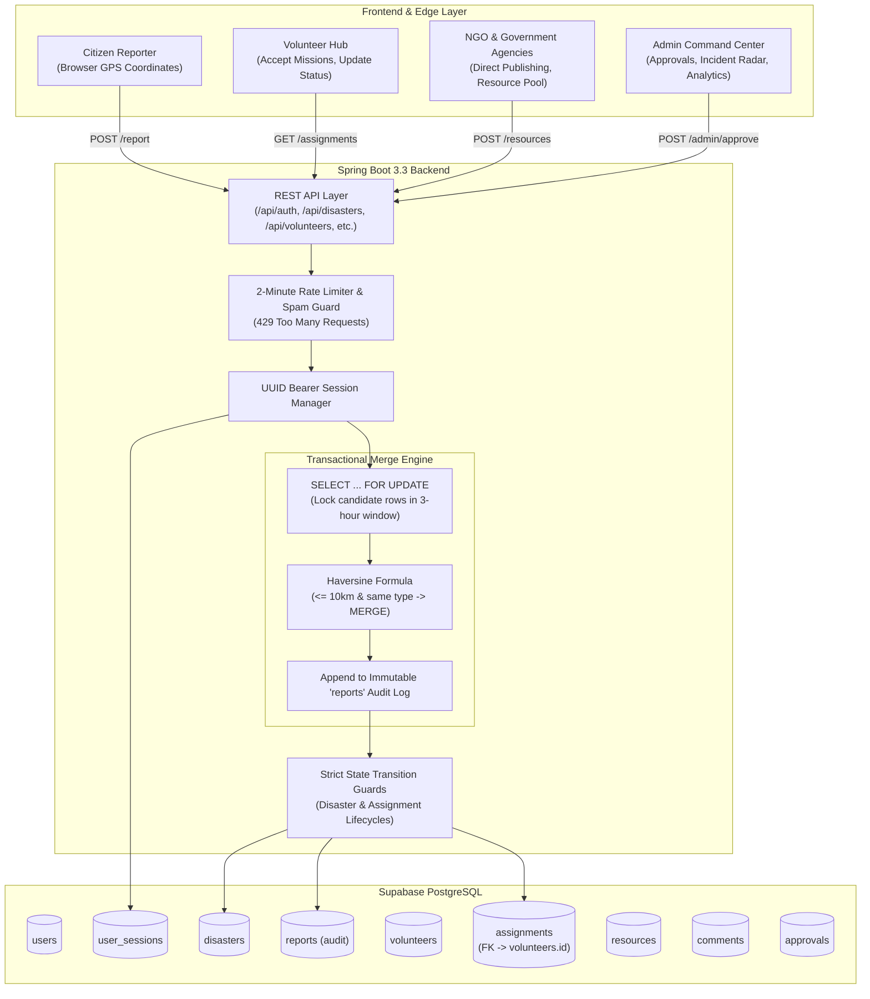

# 🚨 Production Disaster Management Coordination System (Refactored)

A transaction-safe, highly scalable emergency response and disaster management coordination platform built with **Java Spring Boot 3.3** and **Supabase PostgreSQL**.

---

## 🏗️ 1. Architecture & Concurrency Model



---

## ⚡ 2. Disaster Merge Engine & Concurrency Locking

To prevent race conditions during high-volume concurrent citizen reports, `DisasterService` executes inside `@Transactional(isolation = Isolation.READ_COMMITTED)` with **Pessimistic Write Locking** (`LockModeType.PESSIMISTIC_WRITE` $\rightarrow$ `SELECT ... FOR UPDATE`):

```java
@Lock(LockModeType.PESSIMISTIC_WRITE)
@Query("SELECT d FROM Disaster d WHERE d.type = :type " +
       "AND d.status IN :statuses " +
       "AND d.createdAt >= :since")
List<Disaster> findCandidatesForMergeWithLock(
        @Param("type") DisasterType type,
        @Param("statuses") List<DisasterStatus> statuses,
        @Param("since") ZonedDateTime since
);
```

### Merge Rule Criteria:
1. **Status**: `status IN ('PENDING', 'VERIFIED_ACTIVE', 'IN_PROGRESS')`
2. **Temporal Window**: `created_at > NOW() - INTERVAL '3 hours'`
3. **Disaster Type**: Identical `type` (e.g. `FLOOD == FLOOD`)
4. **Spatial Distance**: Haversine distance $d \le 10.0\text{ km}$
   - If matched $\rightarrow$ Increment `report_count`, update severity, insert into `reports` audit table.
   - If no match $\rightarrow$ Create new disaster record and insert initial report into `reports`.

---

## 🛑 3. Rate Limiting & Spam Prevention

- **Policy**: Maximum **1 report per user/phone per 2 minutes** (120-second cooldown).
- **Implementation**: Managed by `RateLimiterService` using a high-throughput `ConcurrentHashMap` sliding window with a database fallback check on `reports(reporter_phone, reported_at)`.
- **Response when exceeded**: HTTP `429 Too Many Requests` with `Retry-After: <seconds>` header.

---

## 🔄 4. Strict State Machine Lifecycles

### Disaster Status Lifecycle:
$$\text{PENDING} \longrightarrow \text{VERIFIED\_ACTIVE} \longrightarrow \text{IN\_PROGRESS} \longrightarrow \text{RESOLVED} \longrightarrow \text{CLOSED}$$

- `PENDING` $\rightarrow$ `VERIFIED_ACTIVE` (Admin approved or direct NGO/Gov publish) or `CLOSED` (Rejected).
- `VERIFIED_ACTIVE` $\rightarrow$ `IN_PROGRESS`, `RESOLVED`, `CLOSED`.
- `IN_PROGRESS` $\rightarrow$ `RESOLVED`, `CLOSED`.
- `RESOLVED` $\rightarrow$ `CLOSED` or `IN_PROGRESS` (Re-opened).
- `CLOSED` $\rightarrow$ **Terminal state** (modifications throw `400 Bad Request`).

### Assignment Status Lifecycle:
$$\text{ASSIGNED} \longrightarrow \text{IN\_PROGRESS} \longrightarrow \text{COMPLETED} \quad (\text{or } \text{CANCELLED})$$

- `assignments.volunteer_id` strictly references `volunteers(id)`.
- When marked `COMPLETED`, `volunteers.helped_count` automatically increments by 1.

---

## 🗄️ 5. Incremental SQL Migration (`migration_v2.sql`)

For databases with existing tables, apply `src/main/resources/db/migration_v2.sql`:

```sql
-- 1. Fix Foreign Key for assignments
ALTER TABLE assignments DROP CONSTRAINT IF EXISTS assignments_volunteer_id_fkey;
ALTER TABLE assignments 
  ADD CONSTRAINT fk_assignments_volunteer_profile 
  FOREIGN KEY (volunteer_id) REFERENCES volunteers(id) ON DELETE CASCADE;

-- 2. Add report_count if missing & ensure check constraint
ALTER TABLE disasters ADD COLUMN IF NOT EXISTS report_count INT NOT NULL DEFAULT 1;
ALTER TABLE disasters DROP CONSTRAINT IF EXISTS disasters_status_check;
ALTER TABLE disasters ADD CONSTRAINT disasters_status_check 
  CHECK (status IN ('PENDING', 'VERIFIED_ACTIVE', 'IN_PROGRESS', 'RESOLVED', 'CLOSED'));

-- 3. Create UUID User Sessions
CREATE TABLE IF NOT EXISTS user_sessions (
    token UUID PRIMARY KEY,
    user_id BIGINT NOT NULL REFERENCES users(id) ON DELETE CASCADE,
    created_at TIMESTAMP WITH TIME ZONE DEFAULT CURRENT_TIMESTAMP,
    expires_at TIMESTAMP WITH TIME ZONE NOT NULL,
    is_active BOOLEAN NOT NULL DEFAULT TRUE
);

-- 4. Fast Indexes for Lock Queries & Rate Limits
CREATE INDEX IF NOT EXISTS idx_disasters_merge_lookup ON disasters(type, status, created_at DESC);
CREATE INDEX IF NOT EXISTS idx_reports_rate_limit ON reports(reporter_phone, reported_at DESC);
CREATE INDEX IF NOT EXISTS idx_assignments_vol_status ON assignments(volunteer_id, status);
```

---

## 🛡️ 6. Error Handling & HTTP Status Matrix

| Scenario | HTTP Status | Response Entity & Details |
| :--- | :--- | :--- |
| **Spam / Exceeded 1 report / 2 min** | `429 Too Many Requests` | `{"success": false, "error": "Too Many Requests", "message": "Rate limit exceeded. Please wait 74 seconds."}` + Header `Retry-After: 74` |
| **Invalid State Transition** | `400 Bad Request` | `{"success": false, "error": "Invalid State Transition", "message": "PENDING disaster can only transition to VERIFIED_ACTIVE or CLOSED."}` |
| **Unapproved NGO/Gov Publishing** | `403 Forbidden` | `{"success": false, "error": "Account Pending Approval", "message": "Your NGO account must be approved by Admin."}` |
| **Unauthorized Action** | `403 Forbidden` | `{"success": false, "error": "Access Denied", "message": "Only Administrator accounts can verify reports."}` |
| **Resource Not Found** | `404 Not Found` | `{"success": false, "error": "Not Found", "message": "Disaster not found with ID: 42"}` |
| **Database / Server Error** | `500 Internal Server Error`| Handled gracefully by `@RestControllerAdvice` |

---

## 🚀 7. Running the Application

```bash
# Run Spring Boot App
mvn spring-boot:run
```
Web App UI: `http://localhost:8080`
